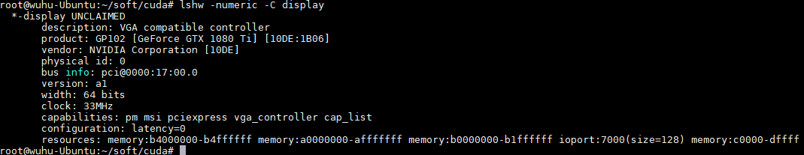
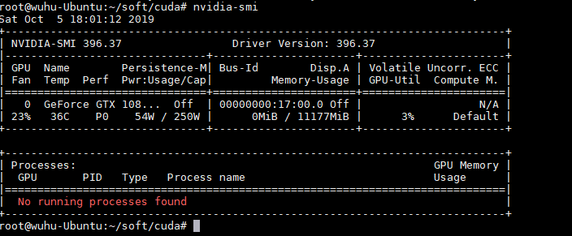

# 安装显卡驱动

1.删除原有NVIDIA驱动
```
sudo apt-get remove --purge nvidia*
```
3.禁用nouveau
```
sudo gedit /etc/modprobe.d/blacklist.conf
```
在最后一行添加
```
blacklist nouneau
```
执行
```
sudo update-initramfs -u
```
重启
```
lsmod | grep nouveau # 没输出代表禁用生效,要在重启之后执行
```
4.查询自己的显卡型号
```
lshw -numeric -C display
```
截图如下
<div>

<div>

5.下载适合自己显卡和系统的驱动：http://www.nvidia.cn/Download/index.aspx?lang=cn

6.给安装程序权限
```
sudo chmod 777 NVIDIA-Linux-x86_64-430.50.run
sudo ./NVIDIA-Linux-x86_64-430.50.run -no-opengl-files -no-x-checks -no-nouveau-check
```
7.驱动测试
```
nvidia-smi
```
截图如下
<div>

<div>

# 安装cuda9.2
1. 下载cuda9.2
https://developer.nvidia.com/cuda-92-download-archive?target_os=Linux&target_arch=x86_64&target_distro=Ubuntu&target_version=1604&target_type=deblocal

2. 执行安装指令
```
sudo dpkg -i cuda-repo-ubuntu1604-9-2-local_9.2.148-1_amd64.deb
sudo apt-key add /var/cuda-repo-<version>/7fa2af80.pub
sudo apt-get update
sudo apt-get install cuda
```

3. 下载cuda9.2补丁，可以不做（此处略过）

4. 修改环境变量
```
gedit ~/.bashrc
# 在最后加入两行：（按照安装提示修改成自己的路径）
	export PATH=/usr/local/cuda/bin:$PATH
	export LD_LIBRARY_PATH=/usr/local/cuda/lib64:$LD_LIBRARY_PATH
# 保存退出之后，运行:
source ~/.bashrc
```

5. 测试cuda：
```
cd /usr/local/cuda-9.0/samples/1_Utilities/deviceQuery
sudo make
./deviceQuery
 
cd ../bandwidthTest
sudo make
./bandwidthTest

看到最后结果是：Result = PASS，即可。
```

# 安装cuDNN7.0
1. 下载：https://developer.nvidia.com/rdp/cudnn-download （需要注册）

2. 下载后得到的文件是四个，两种方法安装：
```
方法一：直接解压并拷贝文件
cudnn-9.2-linux-x64-v7.6.4.38.solitairetheme8，这种格式需要如下处理

cp  cudnn-9.2-linux-x64-v7.6.4.38.solitairetheme8 cudnn-9.2-linux-x64-v7.6.4.38.tgz
tar -xvf cudnn-9.2-linux-x64-v7.6.4.38.tgz

进入解压后的目录中

sudo cp cuda/include/cudnn.h /usr/local/cuda/include
sudo cp cuda/lib64/libcudnn* /usr/local/cuda/lib64
sudo chmod a+r /usr/local/cuda/include/cudnn.h /usr/local/cuda/lib64/libcudnn*
```
```
方法二：安装三个文件并测试
sudo dpkg -i libcudnn7_7.6.4.38-1+cuda9.2_amd64.deb 
sudo dpkg -i libcudnn7-dev_7.6.4.38-1+cuda9.2_amd64.deb
sudo dpkg -i libcudnn7-doc_7.6.4.38-1+cuda9.2_amd64.deb
测试：
cd /usr/src/cudnn_samples_v7/mnistCUDNN
sudo make clean
sudo make
./mnistCUDNN
看到Test passed即可
```
